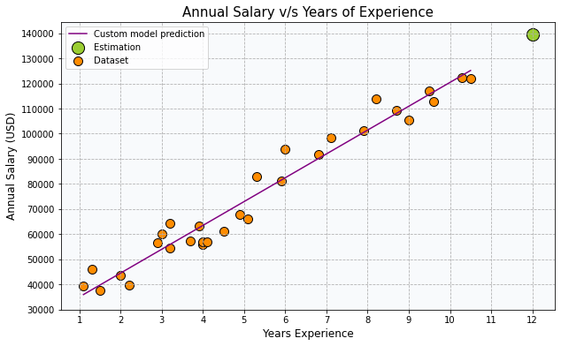
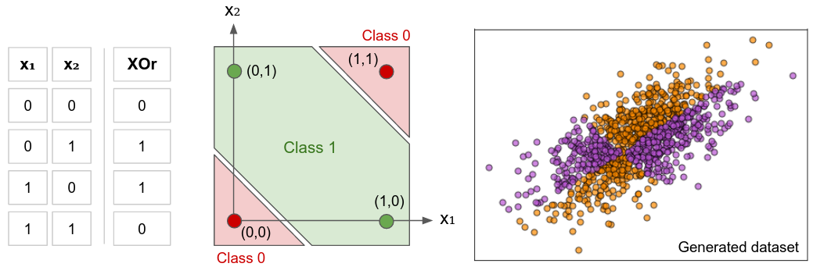

# [Classic machine learning models built from scratch]

 

    
    
    
    
    
    
    

     

In this repository you will find different analysis which are a kind of support for basic machine learning models construction from scratch. By this way models are applied directly on concrete cases, and performances of the models are evaluated against classic prebuilt machine learning models of the Sklearn library.

You will find here the following notebooks:

---

## A Simple Linear Regression from scratch 

**Objective:** The goal is to create a salary estimator based on years of experience of the employees of an anonymous company, using a simple Linear Regression Model build from scratch applied on “Salary_Data.csv” Kaggle’s dataset. Then I will compare the performance of the model against the prebuilt Sklearn linear regression model. 

<a href="https://domsdev.github.io/Data-science-blog/post/a_simple_linear_regression_from_scratch/">Blog post: A Simple Linear Regression from scratch</a>

---

## Multiple and Polynomial Regression from scratch

**Objective:** The goal is to create median house price estimator for Boston city, using a Multiple Linear Regression Model build from scratch, applied on the “Boston Housing Dataset”. Then I will try to improve this estimator, using a Multiple Polynomial Regression Model. 

<a href="https://domsdev.github.io/Data-science-blog/post/multiple_and_polynomial_regression_from_scratch/">Blog post: Multiple and Polynomial Regression from scratch</a>

---

## Building a Neural Network from scratch

**Objective:** The goal here is to deal with the XOr classification problem that can’t be solved with classical logistic regression models. The XOr, or “exclusive or” problem is a classic problem that can be solved with Artificial Neural Network to predict the outputs of XOr logic gates given two binary inputs. The XOr function returns a true value if the two inputs are not equal and a false value if they are equal.I will apply a such ANN built from scratch to a custom dataset generated for XOr binary classification. 
I will apply a such ANN built from scratch to a custom dataset generated for XOr binary classification. 

<a href="https://domsdev.github.io/Data-science-blog/post/building_a_neural_network_from_scratch/">Blog post: Building a Neural Network from scratch</a>

